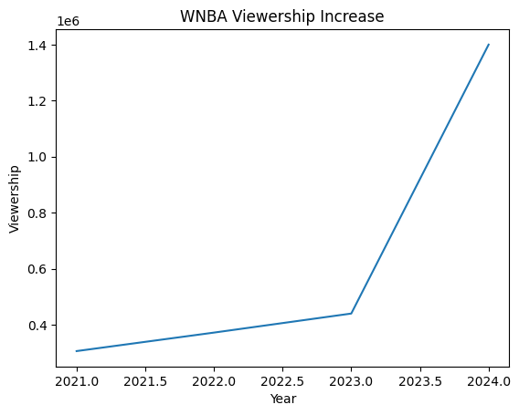

```python
!pip install matplotlib pandas
```


```python
import matplotlib.pyplot as plt
import pandas as pd

# Sample WNBA viewership data (replace with your actual data)
data = {
    'Year': [ 2021, 2022, 2023, 2024],
    'Viewership': [306000, 372000, 440000, 1400000]
}

df = pd.DataFrame(data)
```


```python
plt.plot(df['Year'], df['Viewership'])
plt.xlabel('Year')
plt.ylabel('Viewership')
plt.title('WNBA Viewership Increase')
plt.show()
```


    

    


```python
import matplotlib.pyplot as plt
import pandas as pd

# Sample WNBA viewership data (replace with your actual data)
data = {
    'Year': [2021, 2022, 2023, 2024],
    'Viewership': [306000, 372000, 440000, 1400000]
}

df = pd.DataFrame(data)

plt.bar(df['Year'], df['Viewership'])
plt.xlabel('Year')
plt.ylabel('Viewership')
plt.title('WNBA Viewership Increase')
plt.show()
```


    

    


*Note: only the first five games of 2024 are included in this data set. This is a measurement of the REGULAR SEASON games, and does not include the playoffs.

*From 2023 to 2024 WNBA veiwership increased my more than 50% largely due to the popularity of rookies Angel Reese, and Caitlin Clark


